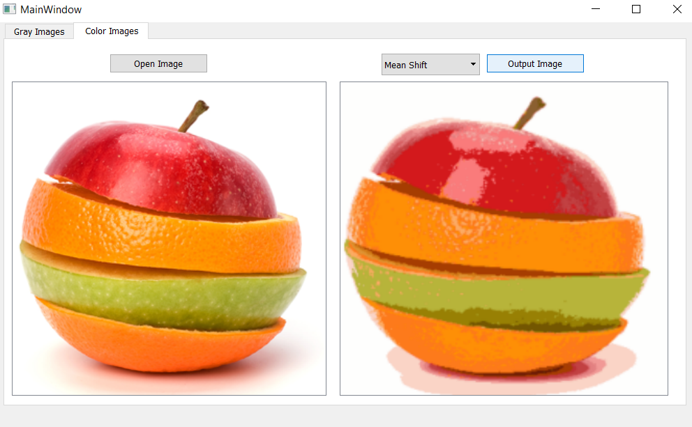

| Member Name    | Sec     | BN  
| ------------- | ------------- | --------    |
| Ahmed khaled hilal | 1         |   3   |
| Dalia lotfy Abdulhay | 1        | 30   |
| Radwa Saeed Mohammady | 1        | 33   |
| Meeran Ahmed Mostafa | 2        | 34  |
| Yousef Samir | 2       | 49   |
| **Group NO.**    |  | 8   |
**Contact mail** : meeranahmed147@gmail.com
------

# Results :

## Thresholding:

1- **Optimal Threshold**

- Original image

  

- After Applying Global optimal threshold

  
  

- After Applying local optimal threshold

  

2- **Otsu Threshold**

- Original image

  

- After Applying Global Otsu threshold

  
  

- After Applying local Otsu threshold

  

3- **Spectral Threshold**

- Original image

  

- After Applying Global Spectral threshold

  
  

- After Applying local Spectral threshold

  
-------

## Conversion from RGB to LUV :

- Original image

  
  

- After Applying luv conversion

  

## Segmentation:
1- **K-Mean**
- Original image

  

- After Segmentation

  

2- **Mean Shift**
- Original image

  

- After Segmentation

  

3- **Agglomerative method**
- Original image

  

- After Segmentation

  

4- **Region growing**
- Original image

  

- After Segmentation

  

# Ui Screenshots :

# Computation Time :

### Thresholding
----

- Optimal

- Otsu 

- Spectral 

-------
### Segmentation
-----
- K- Mean

- MeanShift

- Agglomerative 

- Region growing

### Note : Agglomerative method takes long time to compute, so we use small image as input (that is the reason of appearing pixels in image. )
